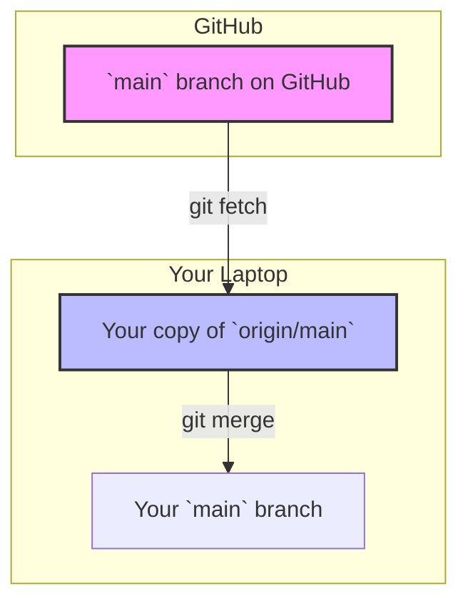

## **Part 1: The "Why" - Introduction to Version Control**

### **What is Version Control and Why Does It Exist?**

Imagine you're writing an important essay.

- **Day 1:** You write a first draft. You save it as `essay_v1.docx`.
    
- **Day 2:** You make big changes and save it as `essay_v2.docx`.
    
- **Day 3:** Your professor suggests changes. You save it as `essay_final.docx`.
    
- **Day 4:** You realize the version from Day 2 was actually better. But where is it? And what _exactly_ did you change between v2 and "final"?
    

This mess is what developers faced for years. A **Version Control System (VCS)** is a tool that solves this problem. It's like a time machine for your project. It automatically tracks every change you make to your files, allowing you to recall specific versions later, see who changed what, and collaborate with others without chaos.

### **Manual Backups vs. Version Control**

What you did with the essay (`v1`, `v2`, `final`) is a manual backup. It's better than nothing, but it has huge problems:

| **Manual Backup (The "Bad" Way)**                                          | **Version Control (The "Good" Way)**                               |
| -------------------------------------------------------------------------- | ------------------------------------------------------------------ |
| 👎 **Clumsy:** You have to remember to save new copies.                    | 👍 **Automatic:** It tracks changes as you make them.              |
| 👎 **Wasteful:** You save full copies of the entire project.               | 👍 **Efficient:** It stores only the _changes_ (or "snapshots").   |
| 👎 **No Context:** You don't know _why_ a change was made.                 | 👍 **Meaningful:** Every change is saved with a message.           |
| 👎 **Hard to Collaborate:** How do you merge your changes with a friend's? | 👍 **Built for Teamwork:** It has powerful tools for merging work. |

### **Centralized vs. Distributed Systems**

There are two main flavors of version control systems.

#### **1. Centralized Version Control (CVCS)**

- **How it works:** There is a **single central server** that stores all the project's history. Developers "check out" files from that server to work on them.
    
- **Example:** Subversion (SVN), Perforce.
    
- **The Big Flaw:** If the central server goes down, nobody can work or save their changes. It's a single point of failure.
    

Code snippet

```
graph TD
    A[Central Server]
    A --> B[Dev 1's Laptop]
    A --> C[Dev 2's Laptop]
    A --> D[Dev 3's Laptop]
```

#### **2. Distributed Version Control (DVCS)**

- **How it works:** Every developer has a **full copy of the entire project history** on their own machine. There's usually a central server (like GitHub) that people use to coordinate, but it's not strictly necessary.
    
- **Example:** **Git**, Mercurial.
    
- **The Big Advantage:** If the main server is offline, you can still work, commit changes, and view history on your local machine. You can even share changes directly with another developer. It's faster and more flexible.
    

Code snippet

```
graph TD
    subgraph Dev 1's Laptop
        A1[Full Project History]
    end
    subgraph Dev 2's Laptop
        B1[Full Project History]
    end
    subgraph Dev 3's Laptop
        C1[Full Project History]
    end
    A1 <--> B1
    B1 <--> C1
    A1 <--> C1
    A1 <--> S[Central Server (e.g., GitHub)]
    B1 <--> S
    C1 <--> S
```

**Git is a Distributed Version Control System**, and it's the most popular one by a huge margin.

---

### **Section 1: Mini Checklist & Key Takeaways**

- [ ] **Understand the Problem:** Can you explain why saving files as `project_final_v2.zip` is a bad idea?
    
- [ ] **Define VCS:** A Version Control System is a "time machine" for your work.
    
- [ ] **Know the Types:** Centralized (one server is king) vs. Distributed (everyone has a full copy).
    
- **Key Takeaway:** Git is a **Distributed** system, which makes it robust, fast, and ideal for modern team collaboration.
    

---

## **Part 2: Getting Started - Setting Up Git**

Alright, theory's over! Let's get the tool installed and configured on your machine. It's a one-time setup.

### **Installing Git**

Git works on all major operating systems. The process is straightforward.

- **Windows:**
    
    1. Go to the official [Git for Windows](https://git-scm.com/download/win) download page.
        
    2. Download the installer and run it.
        
    3. The installer will give you _many_ options. For a beginner, **the default options are perfectly fine**. Just click "Next" through the whole process. This will also install a useful tool called **Git Bash**, which is the command-line interface we'll be using.
        
- **macOS:**
    
    - **Easiest way:** Open your Terminal (you can find it in `Applications/Utilities`) and type `git --version`. If you don't have it, macOS will prompt you to install the Xcode Command Line Tools. Agree to the prompt, and it will install Git for you.
        
    - **Alternative:** If that doesn't work, you can install it with [Homebrew](https://brew.sh/) (a package manager) by running `brew install git`.
        
- **Linux (Debian/Ubuntu):**
    
    - Open your terminal and run the following command:
        
        Bash
        
        ```
        sudo apt-get update
        sudo apt-get install git
        ```
        

### **First-Time Configuration**

After installing, you need to tell Git who you are. This information is attached to every commit you make, so it's important!

Open your terminal (or Git Bash on Windows) and run these two commands, replacing the example info with your own.

1. **Set your username:** This is just your name, not a unique username for a website.
    
    Bash
    
    ```
    git config --global user.name "Your Name"
    ```
    
2. **Set your email:** Use the email you plan to use for services like GitHub.
    
    Bash
    
    ```
    git config --global user.email "youremail@example.com"
    ```
    

The `--global` flag means this setting will apply to every Git project on your computer.

#### **Optional but Recommended: Set Default Branch Name**

Historically, the default branch in Git was called `master`. The industry is now moving towards using `main`. Let's set that as our default.

Bash

```
git config --global init.defaultBranch main
```

### **Checking Your Setup**

To make sure everything is working, run this command:

Bash

```
git --version
```

**Expected Output:** You should see something like this (the version number might be different):

```
git version 2.42.0.windows.1
```

To see the name and email you just configured, you can run:

Bash

```
git config --list
```

---

### **Section 2: Mini Checklist & Key Takeaways**

- [ ] **Install Git:** Is Git installed on your system?
    
- [ ] **Verify Installation:** Does `git --version` show a version number?
    
- [ ] **Configure Identity:** Have you set your `user.name` and `user.email`?
    
- **Key Takeaway:** The one-time `git config` setup is crucial. It acts as your digital signature on all your future work.
    

---

## **Part 3: The "What" - Core Git Concepts**

Before we start using Git, we need to learn three key concepts. Getting this right will make everything else click into place. Think of this as your project's "anatomy."

### **The Three Zones: Working Directory, Staging Area, and Repository**

Your Git project has three main areas. Understanding the flow between them is the **most important concept in Git**.

1. **Working Directory:**
    
    - **What it is:** The actual folder on your computer containing all your project files.
        
    - **Analogy:** This is your **workbench**. It's where you create, edit, and delete files. It's messy and constantly changing.
        
2. **Staging Area (or "Index"):**
    
    - **What it is:** A special holding area where you prepare your next "snapshot." You add finished, polished changes from your workbench to this area.
        
    - **Analogy:** This is your **photographer's canvas**. You've taken 100 photos (made 100 changes), but you carefully select the 5 best ones and arrange them here, ready to be saved permanently.
        
3. **Repository (the `.git` directory):**
    
    - **What it is:** The heart of Git. It's a hidden subfolder named `.git` inside your project folder where Git stores the entire history of your project as a collection of snapshots.
        
    - **Analogy:** This is your **history book or photo album**. Once a snapshot is saved here (a "commit"), it's permanently recorded with a unique ID.
        

The basic workflow always moves in one direction:

Working Directory ➡️ Staging Area ➡️ Repository

### **Snapshots vs. Diffs**

Other old version control systems stored history as a list of differences (or "diffs") between files. For example: "In `file.txt`, change line 5 from 'hello' to 'goodbye'."

Git thinks differently. **Every commit in Git is a full snapshot of your entire project at that moment.**

- **Commit A:** Snapshot of `file1.txt` and `file2.txt`.
    
- **Commit B:** You only changed `file1.txt`. Git stores a _new_ snapshot of the changed `file1.txt` and a _link_ to the unchanged `file2.txt` from Commit A.
    

This makes Git incredibly fast for operations like switching branches or viewing history, because it doesn't need to rebuild a file from a long chain of diffs. It just grabs the correct snapshot.

### **The Git Data Model: Commits as a Timeline**

A commit is more than just a snapshot. It also contains:

- Metadata (author, email, timestamp).
    
- A unique ID (a SHA-1 hash like `e4a9e3a...`).
    
- A pointer to its **parent commit(s)**.
    

This parent-child relationship creates a timeline (or a graph) of your project's history.

```
       (Parent)             (Child)
[Commit A] <---------- [Commit B] <---------- [Commit C]
   ^                                              ^
   |                                              |
(Older)                                        (Newer, HEAD, main)
```

Each commit knows where it came from. This linked list is what allows Git to trace the entire history of your project. The `HEAD` pointer is Git's way of knowing "where you are" right now—it points to the latest commit of the branch you're on.

---

### **Section 3: Mini Checklist & Key Takeaways**

- [ ] **The Three Zones:** Can you name and describe the Working Directory, Staging Area, and Repository?
    
- [ ] **The Workflow:** Do you understand that you must `add` a file to the staging area before you can `commit` it?
    
- [ ] **Snapshots, Not Diffs:** Can you explain why Git's "snapshot" model is powerful?
    
- **Key Takeaway:** The "modify -> stage -> commit" cycle is the fundamental rhythm of working with Git. Master this flow, and you've mastered the basics.
    

---

## **Part 4: The "How" - Basic Git Workflow**

Let's get our hands dirty! This is your day-to-day Git toolkit.

#### A Note on Terminal Commands

Before we create our repository, you'll need to know three basic terminal commands to navigate and see your files. The `git init` command is often used _after_ these.

- `mkdir <name>`: **M**a**k**e **D**i**r**ectory. This is used to create a new folder (e.g., `mkdir my-first-repo`).
    
- `ls`: **L**i**s**t. This command shows all the visible files and folders in your current directory. It's useful to run after you create a file to make sure it's there.
    
- `ls -a`: **L**i**s**t **A**ll. This shows _all_ files, including hidden ones. This is very important for Git, as it's the only way to see the hidden `.git` directory that `git init` creates.


### **Creating Your First Repository (`git init`)**

1. Create a new folder for your project.
    
    Bash
    
    ```
    mkdir my-first-repo
    cd my-first-repo
    ```
    
2. Now, tell Git to start tracking this folder.
    
    Bash
    
    ```
    git init
    ```
    

**Expected Output:**

```
Initialized empty Git repository in C:/Users/YourName/my-first-repo/.git/
```

That's it! Your folder is now a Git repository. It has a hidden `.git` subdirectory where all the magic happens. You never need to touch the files in there yourself.


### **The Core Workflow: Add & Commit**

Let's simulate making a change.

1. Create a file.
    
    Create a file named story.txt in your my-first-repo folder and add some text to it, like "Once upon a time...".
    
2. Check the status (git status).
    
    This is your most-used command. It tells you what's going on.
    
    Bash
    
    ```
    git status
    ```
    
    **Expected Output:**
    
    ```
    On branch main
    No commits yet
    Untracked files:
      (use "git add <file>..." to include in what will be committed)
            story.txt
    
    nothing added to commit but untracked files present (use "git add" to track)
    ```
    
    Git sees a new file, `story.txt`, but it's "untracked." Git won't do anything with it until you say so.
    
3. Stage the file (git add).
    
    Let's move our change from the Working Directory to the Staging Area.
    
    Bash
    
    ```
    git add story.txt
    ```
    
    _Pro Tip:_ You can use `git add .` to stage all new and modified files in the current directory.
    
4. **Check the status again.**
    
    Bash
    
    ```
    git status
    ```
    
    **Expected Output:**
    
    ```
    On branch main
    No commits yet
    Changes to be committed:
      (use "git rm --cached <file>..." to unstage)
            new file:   story.txt
    ```
    
    See the difference? The file is now in the "Changes to be committed" section. It's staged!
    
5. Commit the change (git commit).
    
    Now we'll take the snapshot from the Staging Area and save it permanently to our repository's history.
    
    Bash
    
    ```
    git commit -m "Initial commit: Add story.txt"
    ```
    
    The `-m` flag lets you provide a commit message directly. This message is **critical**—it explains _why_ you made this change.
    
    **Expected Output:**
    
    ```
    [main (root-commit) 5a1b3c4] Initial commit: Add story.txt
     1 file changed, 1 insertion(+)
     create mode 100644 story.txt
    ```
    

Congratulations, you've made your first commit!

### **Viewing Commit History (`git log`)**

How do you see the snapshots you've saved?

Bash

```
git log
```

**Expected Output:**

```
commit 5a1b3c4d9e8f7g6h5j4k3l2m1n0b9v8c7x6z5 (HEAD -> main)
Author: Your Name <youremail@example.com>
Date:   Thu Oct 16 14:30:00 2025 +0530

    Initial commit: Add story.txt
```

This shows you the full commit ID, the author, date, and the message. For a quick summary, use:

Bash

```
git log --oneline
```

**Expected Output:**

```
5a1b3c4 (HEAD -> main) Initial commit: Add story.txt
```

### **Undoing Changes (The "Oops" Commands)**

- Oops, I staged a file I didn't want to (git restore --staged).
    
    You git add'd a file by mistake. To un-stage it (move it from Staging back to Working Directory):
    
    Bash
    
    ```
    git restore --staged <file_name>
    ```
    
- Oops, I want to discard my local changes (git restore).
    
    You've edited a file but decide you want to throw away all the changes you made since the last commit.
    
    Bash
    
    ```
    # WARNING: This will permanently delete your changes in that file.
    git restore <file_name>
    ```
    
- Oops, I made a typo in my last commit message (git commit --amend).
    
    If you just committed and realized you made a mistake in the message:
    
    Bash
    
    ```
    git commit --amend -m "A better commit message"
    ```
    
    This will replace the very last commit with a new one. **Never do this on commits you've already shared with others!**
    

---

### **Section 4: Mini Checklist & Common Mistakes**

- [ ] **Create a Repo:** Can you create a new Git repository from scratch?
    
- [ ] **The Cycle:** Can you take a new file through the `status -> add -> commit` cycle?
    
- [ ] **Check History:** Do you know how to view a list of all your commits?
    
- **Common Mistake #1:** Forgetting to run `git add` before `git commit`. If you do this, your commit will be empty because the staging area was empty. `git status` is your best friend here.
    
- **Common Mistake #2:** Writing useless commit messages like "stuff" or "update." A good message explains the _why_, not the _what_.
    
- **Key Takeaway:** `git status` should be your reflex. Run it often to understand the state of your three zones.
    
### Part 4.5: The "How" - Managing Files

This part covers essential commands for managing individual files: seeing your changes before you stage them and properly telling Git when you've moved or deleted something.

#### Seeing Your Changes (git diff)

You've edited a file, but before you run `git add`, you want to see exactly _what_ you changed. Did you just fix a typo or accidentally delete a whole function? `git diff` is your magnifying glass.

1. See what's in your Working Directory (but not Staged).

This is the most common use. It compares your "workbench" (Working Directory) to your "photographer's canvas" (Staging Area).

Bash

Bash

```
# This shows all changes you haven't staged yet
git diff
```

Expected Output:

Diff

```
diff --git a/story.txt b/story.txt
index 5a1b3c4..e9a8f7b 100644
--- a/story.txt
+++ b/story.txt
@@ -1,1 +1,2 @@
 Once upon a time...
+A dragon appeared.
```

- `--- a/story.txt` shows the "old" version (what's in the staging area/last commit).
    
- `+++ b/story.txt` shows the "new" version (what's in your working directory).
    
- `+A dragon appeared.` shows the line you added. (A `-` sign would show a line you removed).
    

2. See what's Staged (but not Committed).

You've used git add, and now you want to double-check what's in that snapshot you're about to commit. This compares your Staging Area to your Repository (last commit).

Bash

Bash

```
# Shows changes that are staged and ready to be committed
git diff --staged
```

**Pro Tip:** Run `git diff` before `git add` and `git diff --staged` before `git commit`. This two-step check helps you craft perfect, atomic commits.

#### Renaming & Deleting Files (git mv, git rm)

What happens if you just use your computer's `mv` or `rm` command?

- `rm story.txt`: Git will see this as a "deleted" file in your working directory, and you'd still have to `git add` that change.
    
- `mv story.txt chapter1.txt`: Git will get confused. It will see an "untracked" file named `chapter1.txt` and a "missing" file named `story.txt`.
    

Using Git's commands is cleaner because they _automatically stage the change_ for you.

**1. Deleting a file from Git's tracking:**

Bash

Bash

```
# This removes the file from your working directory AND stages the deletion
git rm story.txt
```

Now, if you run `git status`, you'll see:

```
Changes to be committed:
  (use "git restore --staged <file>..." to unstage)
        deleted:    story.txt
```

**2. Renaming a file in Git:**

Bash

Bash

```
# This renames the file AND stages the move
git mv story.txt chapter1.txt
```

Now, `git status` will show:

```
Changes to be committed:
  (use "git restore --staged <file>..." to unstage)
        renamed:    story.txt -> chapter1.txt
```

---

#### Section 4.5: Mini Checklist & Key Takeaways

☐ Check Your Work: Do you know how to use git diff to see your unstaged changes?

☐ Check Your Staging: Do you know how to use git diff --staged to see what you're about to commit?

☐ Manage Files: Can you explain why git rm and git mv are better than the standard rm and mv commands for a Git repo?

- **Key Takeaway**: `git diff` is your safety check to ensure you're only staging and committing the exact changes you intend to. `git rm` and `git mv` are the proper way to tell Git about deletions or renames, as they stage the changes for you.
---

## **Part 5: Parallel Universes - Branching and Merging**

This is where Git's true power shines. Branches let you work on different features or experiments in isolation without affecting the main project.

### **What Are Branches?**

A branch is simply a **movable pointer** to a specific commit. When you start, you have one branch called `main`, which points to your latest commit.

When you create a new branch, you're essentially creating a **new pointer**. It doesn't create a new copy of your files; it's incredibly lightweight.

Think of your project history as a tree trunk (`main`). A branch is like a new limb growing off that trunk. You can work on that limb, and it won't affect the trunk until you decide to **merge** it back in.

**Why use branches?**

- To develop a new feature without breaking the stable `main` branch.
    
- To fix a bug without introducing unfinished feature code.
    
- To experiment with an idea you might throw away.
    

### **Branching Commands (`git branch`, `git switch`)**

Let's try it.

1. Create a new branch.
    
    Let's create a branch to add a new character to our story.
    
    Bash
    
    ```
    git branch add-character
    ```
    
    This creates the branch, but you're still on `main`.
    
2. Switch to the new branch.
    
    To start working on the branch, you need to switch to it.
    
    Bash
    
    ```
    git switch add-character
    ```
    
    _Older command:_ You will often see `git checkout add-character`. `git switch` is the modern, safer command for this.
    
    **Expected Output:**
    
    ```
    Switched to branch 'add-character'
    ```
    
```
    Pro Tip: You can create and switch to a new branch in one command:
    
    git switch -c <new-branch-name>
```
    
3. Make a change and commit.
    
    Now that you're on the add-character branch, open story.txt and add a new line: "A dragon appeared."
    
    Now, do the usual add/commit cycle:
    
    Bash
    
    ```
    git add story.txt
    git commit -m "Feat: Add dragon character"
    ```
    
    Your history now looks like this:
    
    ```
    (Initial Commit) <-- (Add dragon character) <-- HEAD, add-character
           ^
           |
          main
    ```
    
    The `main` branch is still pointing at the initial commit, but your new branch has moved forward.

	**4. Renaming a Branch (git branch -m)** If you make a typo or want to rename your current branch, you can use the `-m` (move) flag.

Bash

Bash

```
# Renames your current branch to <new-branch-name>
git branch -m <new-branch-name>
```

This is very commonly used to rename the old default `master` branch to `main` if your repository was created with the outdated name

5. **Switch back to `main`.**
    
    Bash
    
    ```
    git switch main
    ```
    
    Now, open `story.txt`. The "A dragon appeared" line is gone! That's because that change only exists on the `add-character` branch. Your `main` branch is still clean.
    

### **Merging (`git merge`) and Resolving Conflicts**

You've finished your feature on the `add-character` branch, and now you want to bring that change into your main codebase. This is called **merging**.

1. **First, switch to the branch you want to merge INTO.** We want to update `main`, so:
    
    Bash
    
    ```
    git switch main
    ```
    
2. Run the git merge command.
    
    Tell Git which branch you want to merge into your current branch (main).
    
    Bash
    
    ```
    git merge add-character
    ```
    
    **Expected Output (Fast-Forward Merge):**
    
    ```
    Updating 5a1b3c4..e9a8f7b
    Fast-forward
     story.txt | 1 +
     1 file changed, 1 insertion(+)
    ```
    
    This was a "fast-forward" merge. Because `main` hadn't changed since the `add-character` branch was created, Git could just move the `main` pointer forward to point to the same commit as `add-character`. It's the simple case.
    

#### **The Dreaded Merge Conflict**

What happens if you make a change on `main` _while_ someone else makes a conflicting change on another branch?

1. On `main`, edit `story.txt` to say "The sun was shining." and commit it.
    
2. Create and switch to a new branch: `git switch -c change-weather`.
    
3. On this new branch, edit the _same line_ in `story.txt` to say "It was a dark and stormy night." and commit it.
    
4. Now, try to merge it back:
    
    Bash
    
    ```
    git switch main
    git merge change-weather
    ```
    

**Expected Output (CONFLICT!):**

```
Auto-merging story.txt
CONFLICT (content): Merge conflict in story.txt
Automatic merge failed; fix conflicts and then commit the result.
```

Git is stuck! It doesn't know which change to keep. It has paused the merge and is asking you, the human, to decide.

If you open `story.txt`, you'll see this:

```
<<<<<<< HEAD
The sun was shining.
=======
It was a dark and stormy night.
>>>>>>> change-weather
```

- `<<<<<<< HEAD`: This is what's on your current branch (`main`).
    
- `=======`: This divides the two conflicting versions.
    
- `>>>>>>> change-weather`: This is what's on the branch you're trying to merge.
    

**To resolve the conflict:**

1. **Edit the file manually.** Delete the `<<<`, `===`, `>>>` markers and make the line read exactly how you want the final version to look. For example, you might decide: "It was a dark and stormy night, even though the sun had been shining earlier."
    
2. **Stage the resolved file.** `git add story.txt`
    
3. **Commit the merge.** `git commit` (You don't need a `-m` flag; Git will open an editor with a pre-written merge commit message. Just save and close it.)
    

You've now successfully resolved a merge conflict

#### Comparing Branches (git diff)

Before you merge, you might want to see a summary of _all_ the differences between your feature branch and `main`. You can ask Git to show you a `diff` of the two branch "tips."

Bash

Bash

```
# Shows all changes between main and the add-character branch
git diff main..add-character
```

This will output a list of all the file changes, additions, and deletions between the two branches. It's a great final review to run _before_ you type `git merge`.

---

### **Section 5: Mini Checklist & Key Takeaways**

- [ ] **Branching:** Can you create a new branch, switch to it, and make a commit?
    
- [ ] **Merging:** Do you know the two steps to merge a feature branch into `main`? (`switch` then `merge`)
    
- [ ] **Conflict Resolution:** Can you identify the conflict markers in a file and describe the three steps to resolve the conflict?
    
- **Key Takeaway:**Branch early, branch often.** Branches are cheap and easy. Use them for everything. Your `main` branch should always be stable and deployable.

## **Part 6: Going Remote - Working with Remote Repositories**

So far, your Git repository lives only on your computer. It's like having a diary locked in your room. A **remote repository** is a version of your project that is hosted on the internet or a network. Think of it as a "master copy" in the cloud.

This is essential for two reasons:

1.  **Backup:** If your computer breaks, your entire project history is safe on the remote.
2.  **Collaboration:** It's the central place where you and your team can share changes.

The most popular services for hosting remote repositories are **GitHub**, **GitLab**, and **Bitbucket**. We'll use GitHub for our examples, but the concepts are universal.

### **Connecting to a Remote: SSH vs. HTTPS**

When you communicate with a remote server like GitHub, you need to prove who you are. Git offers two main ways to do this:

| HTTPS | SSH (Secure Shell) |
| :--- | :--- |
| **How it works:** Uses a URL like `https://github.com/user/repo.git`. | **How it works:** Uses a URL like `git@github.com:user/repo.git`. |
| **Authentication:** You'll be asked for your GitHub username and a password or a **Personal Access Token (PAT)**. (GitHub now requires tokens, not passwords, for security). | **Authentication:** You set up a pair of "keys" - a public key you give to GitHub and a private key that stays on your computer. It's like giving GitHub a copy of your house key, but one that can only unlock the front door and nothing else. |
| **Best for:** Beginners, public repositories, or quick clones. | **Best for:** Frequent users. It's more secure and you don't have to type your credentials every time. |

**Recommendation for Beginners:** Start with **HTTPS**. It's easier to set up. As you become more comfortable, switching to SSH is a great next step.

### **The Main Commands for Remote Work**

Let's imagine you've found a cool project on GitHub and want to get a copy on your machine.

#### **`git clone`: Copying a Remote Repo**

This is how you get a local copy of an existing remote repository.

1.  Go to any project on GitHub.
2.  Click the green "\<\> Code" button.
3.  Make sure the "HTTPS" tab is selected and copy the URL.
4.  In your terminal, navigate to where you want to store the project, and run:
    ```bash
    git clone https://github.com/some-user/some-cool-project.git
    ```

**Expected Output:**

```
Cloning into 'some-cool-project'...
remote: Enumerating objects: 100, done.
remote: Counting objects: 100% (100/100), done.
remote: Compressing objects: 100% (1/1), done.
remote: Total 100 (delta 0), reused 0 (delta 0), pack-reused 0
Receiving objects: 100% (100/100), 15.21 KiB | 2.53 MiB/s, done.
Resolving deltas: 100% (50/50), done.
```

This does three things:

1.  Creates a new folder named `some-cool-project`.
2.  Downloads the entire project history into a `.git` directory inside it.
3.  Automatically sets up a connection to the remote URL, naming it `origin` by default.

#### **`git remote`: Managing Your Connections**

The `origin` is the default shorthand name Git gives to the remote you cloned from. You can see your remotes with:

```bash
# First, cd into the new cloned directory
cd some-cool-project
git remote -v
```

**Expected Output:**

```
origin  https://github.com/some-user/some-cool-project.git (fetch)
origin  https://github.com/some-user/some-cool-project.git (push)
```

**What if you started a project locally (`git init`) and now want to connect it to a new, empty GitHub repo?**

1.  Create a new, empty repository on GitHub.
2.  GitHub will give you the commands. The main one is `git remote add`.
    ```bash
    # This command adds a new remote named 'origin' at the specified URL
    git remote add origin https://github.com/your-username/your-new-repo.git
    ```

#### **`git push`: Sending Your Commits Upstream**

You've made a few commits locally. They don't exist on the remote yet. **Pushing** is the act of sending your local commits to the remote repository.

```bash
# Syntax: git push <remote_name> <branch_name>
git push origin main
```

The first time you push a new branch, you may need to use an extra flag (`-u`) to tell Git to link your local branch with the remote one:

```bash
git push -u origin main
```

This "sets the upstream," so in the future, you can just type `git push`.

#### **`git fetch` and `git pull`: Getting Changes from Others**

What if your teammate has pushed their changes to the remote? Your local copy is now out of date.

  * `git fetch`: This is the **safe** way to update. It downloads all the new data from the remote (`origin`) but **does not** automatically merge it into your working branch. It just updates your "remote-tracking branches" (like `origin/main`). You can then see what changed before deciding to merge.
    ```bash
    git fetch origin
    ```
  * `git pull`: This is a shortcut command that does two things in one: `git fetch` followed by `git merge`. It downloads the new changes and immediately tries to merge them into your current branch.
    ```bash
    git pull origin main
    ```

**The Golden Rule:** Always `git pull` (or `fetch` and `merge`) before you start new work to make sure you have the latest version of the project. This helps avoid merge conflicts.



**`git pull` does both steps in one command.**

-----

### **Section 6: Mini Checklist & Key Takeaways**

  * [ ] **Cloning:** Can you copy a repository from GitHub to your local machine?
  * [ ] **The Cycle:** Do you understand the `pull -> work (commit) -> push` cycle for collaboration?
  * [ ] **Command Purpose:** Can you explain the difference between `git push` and `git pull`?
  * **Common Mistake:** Working on old code. Forgetting to `git pull` before you start working. You might end up building a feature based on an outdated version of the code, which will lead to difficult merges later.
  * **Key Takeaway:** `origin` is the default name for your primary remote repository. **Push** to share your work; **pull** to get the latest updates from others.

## **Part 7: Team Play - Collaborative Workflows**

When you're on a team, everyone is pushing and pulling from the same central repository. Without some rules, this would be pure chaos. Collaborative workflows are the agreed-upon "rules of the road" that keep development smooth, organized, and conflict-free.

### **Forks vs. Clones: Two Ways to Get the Code**

You already know `git clone`. It creates a direct copy of a repository on your machine, and you usually have permission to push back to it. But what if you want to contribute to a project you _don't_ have permission to edit, like a popular open-source library?

That's where **forking** comes in.

|**Cloning**|**Forking**|
|---|---|
|**What it is:** A direct, linked copy.|**What it is:** Your own personal server-side copy.|
|**Where it happens:** You run `git clone` on your computer.|**Where it happens:** You click the "Fork" button on GitHub/GitLab.|
|**Permissions:** You typically need "write" access to the original repo to push changes.|**Permissions:** You don't need any permission. You get a full copy in your own account that you control completely.|
|**Typical Use Case:** Working on a project with your team where everyone is a trusted collaborator.|**Typical Use Case:** Proposing a change to an open-source project or a project owned by another team.|

**The Forking Workflow:**

1. **Fork:** You click "Fork" on the original project's GitHub page. This creates `your-username/the-project` in your account.
    
2. **Clone:** You `git clone` your _forked_ version to your local machine.
    
3. **Branch & Commit:** You create a branch, make your changes, and commit them locally.
    
4. **Push:** You `git push` your changes to _your fork_, not the original project.
    
5. **Pull Request:** You then open a **Pull Request** from your fork back to the original project, asking them to review and merge your changes.
    

Code snippet

```
graph TD
    subgraph Original Project (e.g., react/react)
        A[Main Repository]
    end
    subgraph Your GitHub Account
        B[Your Fork of the Repo]
    end
    subgraph Your Laptop
        C[Local Clone of Your Fork]
    end

    A -- 1. Fork on GitHub --> B
    B -- 2. git clone --> C
    C -- 3. git push --> B
    B -- 4. Open Pull Request --> A
```

### **Pull Requests: The Heart of Modern Collaboration**

A **Pull Request (PR)**—also called a "Merge Request" in GitLab—is a formal way of saying, "I've completed some work on a branch, and I'd like you to review it and merge it into the main codebase."

It's not a Git command, but a feature of platforms like GitHub. A PR is a discussion forum built around a set of changes (a branch).

**The Pull Request Lifecycle:**

1. **You Push a Branch:** You finish your work on a feature branch (e.g., `feat-user-login`) and push it to the remote repository (`origin`).
    
2. **You Open a PR:** On GitHub, you'll see a prompt to create a PR from your recently pushed branch. You'll target the `main` branch, give your PR a clear title and description, and assign reviewers.
    
3. **Code Review:** Your teammates review the changes. They can leave comments on specific lines of code, ask questions, or request modifications. This is one of the most valuable parts of the process! It ensures code quality and shares knowledge.
    
4. **Discussion & Updates:** You discuss the feedback and make more commits on your branch to address the comments. Pushing these new commits automatically updates the PR.
    
5. **Approval & Merge:** Once your team is happy with the changes and any automated checks (like tests) have passed, the PR is approved. A project maintainer then clicks the "Merge" button on GitHub, which merges your feature branch into the `main` branch.
    
6. **Clean Up:** After merging, it's good practice to delete the feature branch to keep the repository tidy.
    

#### Part 7.2: The Git Ecosystem: GUIs and Web Interfaces

While the command line is Git's source of truth, you won't always be working in it. Your tools and platforms provide powerful visual ways to interact with Git.

**1. The Web Interface (GitHub, GitLab, etc.)** You don't always need to clone a repository to make a change. Platforms like GitHub allow you to perform many Git actions directly from the website:

- **Edit Files:** You can navigate to any file in a repository you have access to, click the "Edit" (pencil) icon, and make changes.
    
- **Commit Changes:** When you save your edit, GitHub will present a "Commit changes" dialog. This is doing a `git add` and `git commit` for you in one step, right on the remote server.
    
- **Usefulness:** This is perfect for quick, simple changes like fixing a typo in the `README.md`, correcting documentation, or making a small configuration tweak.
    

**2. IDE Integration (e.g., Visual Studio Code)** Modern code editors like VS Code are "Git-aware" and provide powerful visual feedback that complements your command-line workflow:

- **Visual Status:** The editor's "Source Control" panel provides a live `git status`. It will show you your `M` (Modified) and `U` (Untracked) files in a list. You can click a file to see a `diff` and click a "+" icon to `git add` it.
    
- **Visual Merge Conflict Resolution:** This is where IDEs truly shine. When you have a merge conflict, your editor will highlight the conflicting blocks directly in the file. It will render "Accept Current Change," "Accept Incoming Change," and "Accept Both Changes" buttons above the conflict, allowing you to resolve it with a single click instead of manually deleting the `<<<<<<<`, `=======`, and `>>>>>>>` markers .
    

---

#### Section 7.2: Mini Checklist & Key Takeaways

☐ **Web Commits**: Do you know how to edit and commit a file directly on the GitHub website? ☐ **IDE Awareness**: Do you understand how your code editor (like VS Code) helps you by visually showing your `git status`? ☐ **Visual Merging**: Do you know that your IDE can help you resolve merge conflicts with simple buttons?

- **Key Takeaway**: The command line is for _power_ and _precision_. Visual tools (websites, IDEs) are for _convenience_ and _clarity_. Use both to be an effective developer.


### **Common Git Workflow Models**

Teams usually adopt a standard strategy for how they use branches. Here are the most common ones.

#### **1. Feature Branch Workflow (What you've been learning)**

- **How it works:** All new work is done on a dedicated feature branch (e.g., `feat-new-logo`, `fix-login-bug`). The `main` branch is kept stable and clean. Work is only merged into `main` after a Pull Request and code review.
    
- **Best for:** Almost everyone. It's simple, clean, and the standard for most projects today.
    

#### **2. GitFlow Workflow**

- **How it works:** This is a more rigid and structured workflow. It has two main long-lived branches: `main` (for official, tagged releases) and `develop` (for integrating features). It also uses temporary `feature`, `release`, and `hotfix` branches for specific tasks.
    
- **Best for:** Projects with a scheduled release cycle (e.g., traditional desktop software) or that need to support multiple versions in production. It's often considered overly complex for web applications.
    

#### **3. Trunk-Based Development**

- **How it works:** Developers work on very short-lived branches or sometimes commit directly to the main branch (the "trunk," which is usually `main`). The focus is on small, frequent commits that are continuously integrated and tested.
    
- **Best for:** Experienced teams with a very strong automated testing and CI/CD (Continuous Integration/Continuous Deployment) culture. The goal is to keep the trunk releasable at all times.
    

---

### **Section 7: Mini Checklist & Key Takeaways**

- [ ] **Fork vs. Clone:** Can you explain when you would fork a repository instead of cloning it?
    
- [ ] **Pull Requests:** Can you describe the 5 main steps of a Pull Request lifecycle?
    
- [ ] **Workflow Models:** Can you name the most common workflow (Feature Branch) and one other?
    
- **Common Mistake:** Opening a massive Pull Request. A PR with thousands of lines of changes is almost impossible to review properly. Keep your branches small, focused on a single logical change, and your PRs easy to digest.
    
- **Key Takeaway:** The **Pull Request** is the central hub for team collaboration. It's where code is reviewed, discussed, and quality is ensured before it becomes part of the main project.

### Part 7.5: The GitHub Ecosystem

Beyond just storing code, platforms like GitHub provide a full ecosystem for managing projects. The two most important features you'll use with Pull Requests are **Issues** (for tracking work) and **Releases** (for shipping your work).

#### GitHub Issues: The Project To-Do List

A Pull Request (PR) explains _how_ you made a change3. An Issue explains _why_ the change was needed in the first place.

- **What it is:** An "Issue" is a numbered ticket used to track a single unit of work. This could be a bug report, a feature request, or a simple task.
    
- **Analogy:** If the repository is the project, Issues are the to-do list or bug-tracker sticky notes for the whole team.
    

**The Issue Lifecycle:**

1. **Creation:** A user (or a teammate) reports a bug: "User login fails with special characters." This becomes **Issue #123**.
    
2. **Discussion:** The team discusses the bug in the Issue's comment thread. They confirm it's a real bug and assign it to a developer.
    
3. **Branching:** You create a branch to fix it, often naming the branch after the issue: `git switch -c fix-login-bug-123`.
    
4. **Linking:** You make your commits and open a Pull Request. In the PR description, you write a magic phrase like **"Closes #123"** or **"Fixes #123"**.
    
5. **Closing:** As soon as your Pull Request is merged into `main`, GitHub sees that magic phrase and **automatically closes Issue #123**.
    

This creates a perfect, traceable link. Anyone looking at the closed Issue #123 can see exactly which PR fixed it, and anyone looking at the PR can see which Issue it was meant to fix.

#### GitHub Releases: Shipping Your Tags

In Part 8, you'll learn about `git tag` to create a "milestone marker" like `v1.0.1`4. A GitHub Release is a user-friendly, public-facing webpage _for that tag_.

While a tag is just a pointer for developers5, a **Release** is a formal package for your _users_.

**How it works:**

1. Tag your code: You finish your work for the new version and tag the main branch.
    
    Bash
    
    Bash
    
    ```
    # Create an annotated tag for your new version
    git tag -a v1.0.1 -m "Version 1.0.1 Bug fixes for release"
    # Push the tag to GitHub
    git push origin v1.0.1
    ```
    
2. **Draft a New Release:** On your GitHub repository page, you go to the "Tags" or "Releases" section.
    
3. **Create Release from Tag:** You find your `v1.0.1` tag and click "Create Release."
    
4. **Add Release Notes:** This is the key part. You give it a title (e.g., "Version 1.0.1") and write a user-friendly changelog. This is where you explain, in plain English, what's new.
    
    - ✨ **New Features:** Added password reset via email.
        
    - 🐛 **Bug Fixes:** Fixed a crash when uploading images.
        
    - 🧹 **Maintenance:** Upgraded server dependencies.
        
5. **Add Assets (Optional):** If your project builds an installer, a `.zip` file, or a PDF manual, you can attach these binary files to the release.
    
6. **Publish:** You publish the release, and it's now a permanent, public page that users can visit to download the new version and read what's changed.
    

---
#### Section 7.5: Mini Checklist & Key Takeaways

☐ Track Work: Can you explain what a GitHub Issue is and why it's used?

☐ Link Work: Do you know how to link a Pull Request to an Issue so it closes automatically?

☐ Ship Work: Can you describe the difference between a git tag and a GitHub Release?

☐ Release Process: Do you know the steps to create a new, user-facing Release on GitHub?

- **Common Mistake**: Making a Pull Request with no context. A good PR will almost always reference an Issue to explain the _why_ behind the _what_.
    
- **Key Takeaway**: Issues track _what needs to be done_. Pull Requests track _how it's being done_. Releases package the _finished work_ for your users.

## **Part 8: The Power Tools - Advanced Git**

Think of these tools like a master woodworker's specialty chisels. You won't use them every day, but when you need them, they are invaluable for creating clean, professional work.

### **`git rebase`: The History Editor**

You know that `git merge` creates a "merge commit" that ties two branches together, resulting in a history that looks like a branching graph. **Rebase** offers a different way to integrate changes: it **re-writes history** to be linear.

**What it does:** It takes all the commits from your feature branch and "replays" them, one by one, on top of the latest changes from the `main` branch.

**Analogy:**

- **Merge:** Imagine two lanes of traffic merging onto a highway. The merge point is a new event that brings them together.
    
- **Rebase:** Imagine your lane of traffic is magically lifted and placed at the end of the other lane, creating one long, single line of cars.
    

Code snippet

```
graph TD
    subgraph Before
        A[main] --> B
        A --> C[feature] --> D
    end
    subgraph After Merge
        A2[main] --> B2
        A2 --> C2[feature] --> D2
        B2 --> M[Merge Commit]
        D2 --> M
    end
    subgraph After Rebase
        A3[main] --> B3 --> C3[feature] --> D3
    end
```

**How to use it:**

1. You are on your feature branch, and `main` has been updated by your team.
    
2. First, get the latest `main`: `git fetch origin`.
    
3. Then, run the rebase command:
    
    Bash
    
    ```
    # While on your feature branch
    git rebase origin/main
    ```
    

The Golden Rule of Rebase:

NEVER rebase a branch that has been pushed to a remote and is being used by other people.

Rebasing creates new commits (with new IDs) for your old work. If you rebase a shared branch, your history will diverge from your teammate's. When they try to pull, Git will see two different histories and get very confused, leading to a major cleanup headache. Only rebase your own local branches that you haven't shared yet.

### **`git stash`: The Pause Button**

You're in the middle of a complex feature when your boss runs over: "There's a critical bug on the live site! Fix it now!" Your current work is a mess and not ready to be committed. What do you do? You `stash` it.

**What it does:** `git stash` takes all your uncommitted changes (both staged and unstaged) and saves them in a temporary "stash" area, cleaning your working directory.

1. **Save your work:**
    
    Bash
    
    ```
    git stash save "Working on new login form"
    ```
    
2. **Your working directory is now clean.** You can switch branches, fix the bug, commit, and push.
    
3. **Return to your work:**
    
    Bash
    
    ```
    # Switch back to your feature branch
    git switch feature-login-form
    
    # Apply the stashed changes back
    git stash pop
    ```
    

`git stash pop` applies the most recent stash and removes it from the stash list. `git stash apply` does the same but keeps it in the list.

### **`git cherry-pick`: The Surgical Strike**

Imagine your feature branch has five commits, but only one of them contains a critical bug fix that needs to go into `main` _right now_, without the other four commits. You can't merge the whole branch. You need to **cherry-pick**.

**What it does:** It allows you to select a single commit from any branch and apply it to your current branch.

1. Find the hash of the commit you want. Use `git log --oneline` on the feature branch. Let's say it's `a8b3c1d`.
    
2. Switch to the branch where you want to apply it.
    
    Bash
    
    ```
    git switch main
    ```
    
3. Cherry-pick the commit.
    
    Bash
    
    ```
    git cherry-pick a8b3c1d
    ```
    

This will create a new commit on `main` that contains the exact changes from `a8b3c1d`.

### **`git tag`: The Milestone Marker**

Tags are pointers to specific commits in history, like a permanent bookmark. They are typically used to mark release points, such as `v1.0.0`.

- **Create a lightweight tag:** Just a simple pointer.
    
    Bash
    
    ```
    git tag v1.0.1
    ```
    
- **Create an annotated tag (recommended):** This creates a full object in the Git database with the tagger's name, email, date, and a message.
    
    Bash
    
    ```
    git tag -a v1.0.1 -m "Version 1.0.1 - Bug fixes for release"
    ```
    
- **Pushing tags:** Tags are not pushed by default! You have to push them explicitly.
    
    Bash
    
    ```
    # Push a single tag
    git push origin v1.0.1
    
    # Push all your tags
    git push origin --tags
    ```
    

**Semantic Versioning (SemVer):** A common standard for versioning is `MAJOR.MINOR.PATCH` (e.g., `2.1.5`).

- **MAJOR:** for incompatible API changes.
    
- **MINOR:** for adding functionality in a backward-compatible manner.
    
- **PATCH:** for backward-compatible bug fixes.
    

### **Rewriting History Safely: `rebase -i` and `reflog`**

#### **Interactive Rebase (`git rebase -i`)**

This is the Swiss Army knife of history manipulation. It lets you `reword`, `edit`, `squash` (merge multiple commits into one), `fixup` (squash but discard the commit message), and `drop` commits.

**Use Case:** You've made five small commits like "start form," "fix typo," "add button," "oops another typo," "final touches." This is messy. You want to squash them into a single, clean commit before opening a Pull Request.

1. Run the command with the commit _before_ your messy sequence. `HEAD~5` means "the last 5 commits."
    
    Bash
    
    ```
    git rebase -i HEAD~5
    ```
    
2. This opens a text editor with a list of your commits:
    
    ```
    pick 1a2b3c4 start form
    pick 5d6e7f8 fix typo
    pick 9g8h7i6 add button
    pick j6k5l4m oops another typo
    pick n3o2p1q final touches
    ```
    
3. To squash them, you leave the first one as `pick` and change the rest to `squash` (or `s` for short):
    
    ```
    pick 1a2b3c4 start form
    s 5d6e7f8 fix typo
    s 9g8h7i6 add button
    s j6k5l4m oops another typo
    s n3o2p1q final touches
    ```
    
4. Save and close the file. Git will then open another editor asking you to write a new commit message for the single, combined commit.
    

#### **The Safety Net: `git reflog`**

What if you mess up a rebase and think you've lost your commits forever? **Don't panic!** `git reflog` is your guardian angel.

It shows a log of every place `HEAD` has been. It's a history of your _actions_, not just your commits.

**Expected Output:**

```
a8b3c1d HEAD@{0}: rebase -i (finish): returning to refs/heads/my-feature
a8b3c1d HEAD@{1}: rebase -i (squash): Feat: Create user login form
...
f9e8d7c HEAD@{5}: commit: final touches
```

You can find the hash of the state you were in _before_ the bad rebase and restore it using `git reset --hard <hash>`.

---

### **Section 8: Mini Checklist & Key Takeaways**

- [ ] **Rebase vs. Merge:** Can you explain the difference and the Golden Rule of Rebasing?
    
- [ ] **Stash:** Do you know when and how to use `git stash` to pause your work?
    
- [ ] **Cherry-pick:** Can you describe a scenario where `git cherry-pick` is the right tool?
    
- [ ] **Interactive Rebase:** Do you understand the concept of `squash` to clean up your local commit history?
    
- [ ] **Safety Net:** What is `git reflog` and why is it so important?
    
- **Key Takeaway:** Advanced Git commands give you precise control over your project's history. Use them to create a clean, logical, and easy-to-read history _before_ sharing your work with others.

## **Part 9: Git Detective - Troubleshooting & Recovery**

Mistakes happen. You might delete a branch by accident, make a messy merge, or see a scary error message. Panicking is a natural reaction, but with Git, almost everything is fixable. Let's learn how to be a Git detective and solve these common mysteries. 🕵️‍♂️

### **The Ultimate Safety Net: Recovering "Lost" Commits with `reflog`**

**The Scenario:** You just ran a command like `git reset --hard` to discard some changes, but you went too far and accidentally deleted a commit you actually needed. It's not in your `git log` anymore. Is it gone forever?

**No!** Git rarely deletes things permanently right away. It keeps a special log of everywhere your `HEAD` has been. This is the **reflog**.

1. **Run the command:**
    
    Bash
    
    ```
    git reflog
    ```
    
2. **Analyze the output:** You'll see a list of your recent actions, each with an index (`HEAD@{0}`, `HEAD@{1}`) and the commit hash it pointed to.
    
    ```
    a8b3c1d HEAD@{0}: reset: moving to a8b3c1d
    f9e8d7c HEAD@{1}: commit: Add user authentication feature
    c5a4b3e HEAD@{2}: commit: Fix typo in header
    ...
    ```
    
    Look! The commit "Add user authentication feature" (`f9e8d7c`) is still there in the reflog, even if it's gone from your normal log.
    
3. **Recover the commit:** To restore your branch to that point, simply reset to that hash.
    
    Bash
    
    ```
    # This brings your branch back to the state it was in at that commit.
    git reset --hard f9e8d7c
    ```
    

Your "lost" commit is now back as the tip of your branch. Crisis averted!

#### Undoing Your Last Local Commit (The Safe Way)

**The Scenario:** You just made a commit, but you realize you forgot to add a file, or you made a small mistake in the code. You _could_ use `git commit --amend`, but what if you want to completely undo the commit and get your changes back into the working directory to re-work them?

This is where a "soft" reset is used. `HEAD~1` is Git's way of saying "the commit _before_ my current HEAD."

Bash

Bash

```
# This will "un-commit" the last commit, but...
# ...it KEEPS all your changes in your working directory!
git reset HEAD~1
```

**Expected Output:** After running this, `git status` will show the files from that last commit as "Changes not staged for commit" (i.e., back in your Working Directory ).

This is the safest way to undo a local commit. It moves the `HEAD` pointer back one step but doesn't touch your files, giving you a complete do-over.

- Contrast with `git reset --hard`: A `--hard` reset is destructive. It throws away all your uncommitted (and committed, in this case) changes and makes your files match the specified commit. `git reset HEAD~1` (with no flag) is safe and _preserves_ your work.

### **Undoing a Bad Merge**

**The Scenario:** You just merged a feature branch into `main`, but you realized it's full of bugs. You haven't pushed it to the remote yet. How do you undo the merge?

Git creates a special pointer called `ORIG_HEAD` every time it does a potentially dangerous operation, like a merge or a reset. This points to where you were right before the operation.

Bash

```
# This will reset your branch to the commit right before you ran `git merge`.
# The --hard flag will also clean your working directory of the merged files.
git reset --hard ORIG_HEAD
```

It's like the merge never happened.

What if you already pushed the bad merge?

If the merge is already on the remote, do not use git reset. Rewriting shared history is a cardinal sin. Instead, you should create a new commit that undoes the changes from the bad merge. This is done with git revert.

Bash

```
# -m 1 tells Git that in this merge commit (which has two parents),
# we want to keep the history from the first parent (the main branch).
# The merge commit hash can be found with `git log`.
git revert -m 1 <merge_commit_hash>
```

This creates a new commit that says, "I am undoing everything that happened in that merge." It's a safe, forward-moving way to fix mistakes in a shared history.

### **Common Git Error Messages Demystified**

#### **Error 1: "Your local changes... would be overwritten by merge"**

- **What it means:** You have uncommitted changes in your working directory, and the `pull` or `merge` you're trying to do needs to modify those same files. Git is stopping to prevent your work from being accidentally erased.
    
- **The Fix:** You have two options:
    
    1. **Commit your changes:** `git add .` and `git commit -m "WIP"`
        
    2. Stash your changes: git stash
        
        Once your working directory is clean, you can safely pull or merge, and then git stash pop if you stashed.
        

#### **Error 2: "failed to push some refs to..."**

- **What it means:** This almost always means that someone else has pushed changes to the remote branch since the last time you pulled. Your local version of the branch is out of date. Git is preventing you from overwriting their work.
    
- **The Fix:** You need to integrate the remote changes first.
    
    Bash
    
    ```
    git pull
    ```
    
    This will likely download their changes and merge them with yours. You might have to resolve conflicts, but after that, you'll be able to `git push`.
    

#### **Error 3: "detached HEAD" state**

- **What it means:** You aren't on a branch. You've checked out a specific commit, tag, or remote branch directly. You're like a time traveler observing a specific point in history. You can look around, but if you make new commits, they won't belong to any branch.
    
- **The Fix:** If you want to save the work you've done in this state, you just need to create a new branch right where you are.
    
    Bash
    
    ```
    # This creates a new branch and switches to it, re-attaching your HEAD.
    git switch -c my-new-feature-branch
    ```
    

---

### **Section 9: Mini Checklist & Key Takeaways**

- [ ] **The Ultimate Undo:** Do you know which command to use if you think you've permanently deleted a commit? (`git reflog`)
    
- [ ] **Safe Merge Reversal:** Can you explain the difference between undoing a local merge (`git reset`) and a pushed merge (`git revert`)?
    
- [ ] **Error Readiness:** Do you know what to do if Git tells you your local changes would be overwritten? (Commit or Stash).
    
- **Key Takeaway:** Git is designed to be safe. It rarely deletes your work and almost always gives you a way to recover. **`git reflog`** is your most powerful safety net, and understanding common error messages turns panic into a simple, routine fix.

## **Part 10: The Art of Cleanliness - Best Practices**

These aren't strict rules enforced by Git, but they are strong conventions followed by successful development teams worldwide. Adopting them will make your project history clean, understandable, and easy to work with.

### **Writing Meaningful Commit Messages**

A commit message is a message to your future self and your teammates. A message like `"fix"` is useless. A great commit message provides context and answers _why_ a change was made.

**The Anatomy of a Great Commit Message:**

A popular convention is to structure commits like this:

```
Type: A short, imperative summary (max 50 chars)

A more detailed explanatory text, if necessary. Wrap it at
about 72 characters. Explain the problem this commit is
solving. Focus on the "why" not the "how".

Further paragraphs come after blank lines.

- Bullet points are okay, too.
- Typically, you might reference an issue number from a
  tracking system (e.g., Resolves: #123).
```

- **Type:** A prefix that categorizes the commit. Common types include:
    
    - **`feat`**: A new feature for the user.
        
    - **`fix`**: A bug fix for the user.
        
    - **`docs`**: Changes to documentation.
        
    - **`style`**: Formatting, missing semi-colons, etc.; no code logic change.
        
    - **`refactor`**: Restructuring code without changing its external behavior.
        
    - **`test`**: Adding or refactoring tests.
        
    - **`chore`**: Updating build tasks, package manager configs, etc.
        
- **Summary:** Written in the **imperative mood**. Think of it as a command:
    
    - **Good:** `feat: Add user login page` (If applied, this commit will _add_...)
        
    - **Bad:** `Added the login page` or `Adding login page`
        

**Example of a Good Commit:**

```
feat: Implement user password reset via email

Users who forget their password now have a way to recover their
account. This introduces a "Forgot Password" link on the login
page that triggers a secure, token-based email flow.

This closes the loop on the user authentication story and resolves
the critical issue reported in ticket #42.
```

### **Using `.gitignore` Effectively**

Your project folder will inevitably contain files that should **not** be tracked by Git. These include:

- Secret keys, passwords, and API credentials (`.env` files).
    
- Compiled code (`/build`, `/dist`, `.o` files).
    
- System files (`.DS_Store` on macOS, `Thumbs.db` on Windows).
    
- Dependency folders (`/node_modules`, `/vendor`).
    

A `.gitignore` file is a simple text file where you list patterns of files and folders for Git to ignore.

**How to use it:**

1. Create a file named exactly `.gitignore` in the root of your repository.
    
2. Add patterns to it.
    

**Example `.gitignore` file:**

```
# Ignore IDE and OS files
.idea/
.vscode/
.DS_Store

# Ignore dependency directories
node_modules/
vendor/

# Ignore compiled files
/dist
*.class

# Ignore sensitive information
.env
*.log
```

**Pro Tip:** Services like [gitignore.io](https://www.toptal.com/developers/gitignore) can generate a perfect `.gitignore` file for your specific programming language or framework. **Set this up at the very beginning of your project!**

### **Maintaining a Clean History**

A clean history is like a well-written book: easy to read and understand. A messy history is a nightmare to debug.

- **Atomic Commits:** Each commit should represent a single, complete, logical unit of work. Don't lump unrelated changes into one commit (e.g., fixing a bug _and_ refactoring a button _and_ updating the README).
    
- **Don't Commit Broken Code:** Never knowingly commit code that breaks the main application. Your `main` branch should always be stable and potentially deployable. Run tests before you commit.
    
- **Squash Before Merging:** Use interactive rebase (`git rebase -i`) to clean up your messy "work-in-progress" commits on your feature branch _before_ you open a Pull Request. Combine small, trivial commits into larger, meaningful ones.
    

### **Automating Tasks with Git Hooks**

Git hooks are scripts that run automatically at certain points in the Git lifecycle, like before a commit (`pre-commit`) or before a push (`pre-push`).

- **Use Case:** You want to ensure that no one on your team ever commits code that doesn't pass the linter (a code-formatting tool).
    
- **How it works:** You can write a script in the `.git/hooks/pre-commit` file. If the script exits with an error (e.g., the linter fails), Git will abort the commit.
    
- **Tools:** Manually managing hooks can be tricky. Tools like **Husky** (for JavaScript projects) make it incredibly easy to set up and share hooks with your team.
    

### **Integrating Git with CI/CD (Example: GitHub Actions)**

**Continuous Integration (CI)** is the practice of automatically building and testing your code every time a change is pushed to the repository. **Continuous Deployment (CD)** is the practice of automatically deploying the code to a server after it passes the tests.

**GitHub Actions** is a powerful CI/CD tool built right into GitHub. You create a workflow file (in YAML format) in a `.github/workflows/` directory in your repository.

Simple Example Workflow:

When someone pushes to the main branch or opens a PR, this workflow will:

1. Check out the code.
    
2. Set up the required programming language (e.g., Node.js).
    
3. Install dependencies.
    
4. Run the automated tests.
    

This ensures that no code that breaks the test suite can ever be merged, protecting the quality of your `main` branch.

---

### **Section 10: Mini Checklist & Key Takeaways**

- [ ] **Commit Messages:** Do you know the convention for writing a great commit message (Type, Summary, Body)?
    
- [ ] **Ignoring Files:** Have you set up a `.gitignore` file in your project? Can you name two types of files that should always be ignored?
    
- [ ] **Clean History:** Can you explain what an "atomic commit" is?
    
- [ ] **Automation:** Do you understand the purpose of a `pre-commit` hook and what a CI/CD pipeline does?
    
- **Key Takeaway:** Professional software development is not just about writing code; it's about writing code **sustainably**. Best practices in version control are the foundation of that sustainability, making collaboration more efficient and projects easier to maintain.

## **Part 11: The Reference Shelf - Cheat Sheet & Glossary**

You've completed the journey from a complete beginner to an advanced Git user! This final section is your quick-reference guide. Bookmark it, print it, and use it whenever you need a quick reminder. 📚

### **Common Git Commands Cheat Sheet**

#### **Setup & Config**

- `git --version`: Check your installed Git version.
    
- `git config --global user.name "Your Name"`: Set your author name globally.
    
- `git config --global user.email "you@email.com"`: Set your author email globally.
    

#### **Creating & Cloning**

- `git init`: Initialize a new Git repository in the current folder.
    
- `git clone <url>`: Create a local copy of a remote repository.
    

#### **Local Changes (The Core Workflow)**

- `git status`: Check the status of your working directory and staging area.
    
- `git add <file>`: Add a file to the staging area.
    
- `git add .`: Add all new and changed files to the staging area.
    
- `git restore --staged <file>`: Unstage a file (remove it from the staging area).
    
- `git restore <file>`: Discard all local changes in a file.
    
- `git commit -m "Message"`: Commit staged files with a message.
    
- `git commit --amend`: Modify the most recent commit.
    

#### **History & Inspection**

- `git log`: View the commit history.
    
- `git log --oneline`: View a compact, one-line version of the history.
    
- `git diff`: Show changes between your working directory and the staging area.
    
- `git diff --staged`: Show changes between the staging area and the last commit.
    

#### **Branching & Merging**

- `git branch`: List all local branches.
    
- `git branch <branch-name>`: Create a new branch.
    
- `git switch <branch-name>`: Switch to a different branch.
    
- `git switch -c <branch-name>`: Create a new branch and switch to it immediately.
    
- `git merge <branch-name>`: Merge the specified branch into your current branch.
    
- `git branch -d <branch-name>`: Delete a local branch (after it's been merged).
    

#### **Remote Repositories**

- `git remote -v`: List your configured remote repositories.
    
- `git remote add <name> <url>`: Add a new remote repository.
    
- `git fetch <remote>`: Download changes from a remote but don't merge them.
    
- `git pull`: Fetch changes from the remote and merge them into your current branch.
    
- `git push`: Upload your committed changes to the remote.
    
- `git push -u <remote> <branch>`: Push a branch and set its upstream for future pushes.
    

#### **Advanced & Recovery**

- `git rebase <branch-name>`: Re-apply commits from your current branch on top of another.
    
- `git stash`: Temporarily save uncommitted changes.
    
- `git stash pop`: Apply the last stashed changes and remove them from the stash.
    
- `git cherry-pick <commit-hash>`: Apply a single commit from another branch to your current branch.
    
- `git tag -a <tag-name> -m "Message"`: Create an annotated tag.
    
- `git reflog`: View a log of all actions taken in the repo (your safety net).
    
- `git reset --hard <commit-hash>`: **(Destructive)** Reset your branch and working directory to a specific commit.
    

---

### **Glossary of Git Terminology**

- **Branch**: An independent line of development. It's a movable pointer to a commit.
    
- **Clone**: A local copy of a remote repository, including the entire history.
    
- **Commit**: A snapshot of your staged files at a specific point in time, saved to the repository's history.
    
- **Fetch**: To download new data (commits, branches, tags) from a remote repository without integrating it into your local branches.
    
- **Fork**: A personal copy of someone else's repository that lives on your account on a service like GitHub.
    
- **HEAD**: A pointer that refers to the currently checked-out commit. Usually, it points to the tip of your current branch.
    
- **Merge**: The action of combining the changes from one branch into another.
    
- **Origin**: The default shorthand name for the remote repository you cloned from.
    
- **Pull**: The action of fetching changes from a remote and immediately merging them into your current branch (`fetch` + `merge`).
    
- **Push**: The action of uploading your local commits to a remote repository.
    
- **Rebase**: The action of rewriting a branch's history by replaying its commits on top of another branch's commits, creating a linear history.
    
- **Remote**: A version of your repository that is hosted on another server, usually on the internet (e.g., on GitHub).
    
- **Repository (Repo)**: The entire collection of your project's files and its complete version history, stored in the `.git` directory.
    